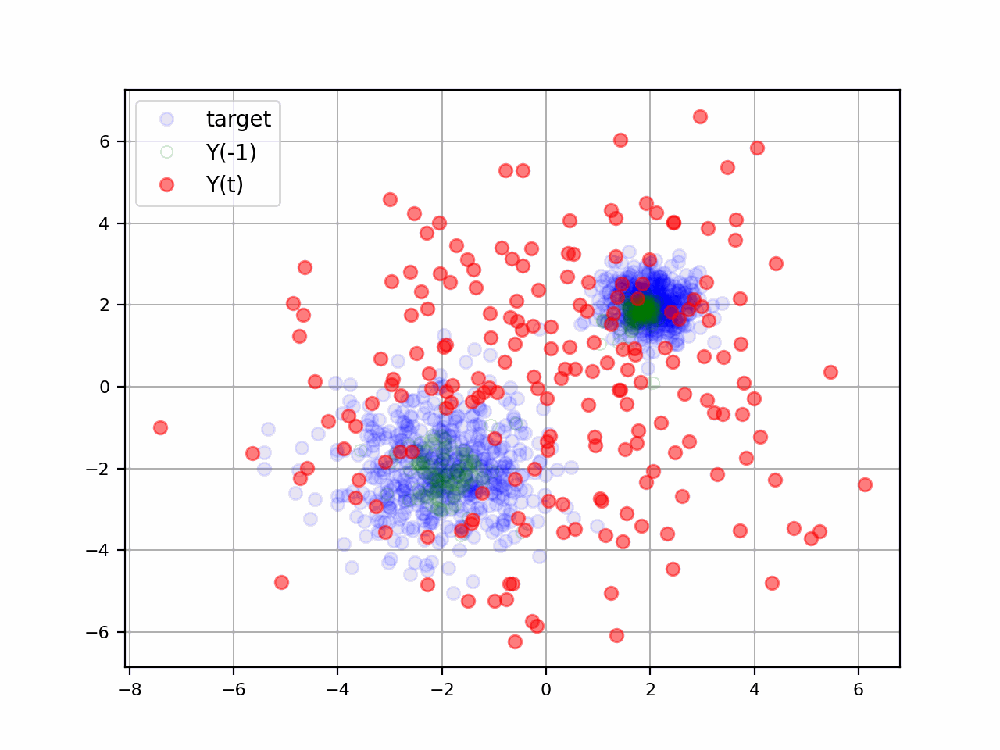
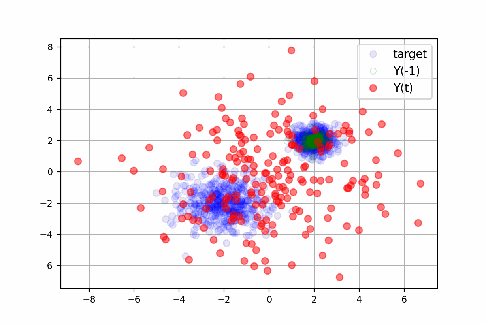

# Score-Based Generative Modeling Through Stochastic Differential Equations
The notebook [`score_based_generative_modeling.ipynb`](score_based_generative_modeling.ipynb) contains a step by step implementation of the score-based generative modeling through stochastic differential equations **[\[1\]](#references)** using PyTorch. The notebook was adapt from the notebook from the same author **[\[2\]](#references)** as part of an homemade exercise. For simplicity, the notebook uses a simple 2D dataset and a simple neural network architecture.


*Forward diffusion process of a two modes Gaussian distribution.*


*Reverse diffusion process of a two modes Gaussian distribution.*


*Conditional sampling from a two modes Gaussian distribution.*

## Quick start
### Installation
In the repository directory, run the following command to install the package.
```Bash
pip install .
```

### Contribute
To contribute to the project, you can clone the repository and install the required dependencies in a virtual environment. You can do so by running the following commands in the repository directory.
 ```Bash
 python -m venv .venv

 .\.venv\Scripts\Activate.ps1 # Powershell
 .\.venv\Scripts\activate.bat # Windows cmd
 source .venv/bin/activate # Ubuntu

 python -m pip install --upgrade pip
 
 pip install -e . # Install the package in development mode
 pip install -r ./requirements.txt
 ```

 **Note:** You might need the following for `Powershell`:
 ```Bash
 Set-ExecutionPolicy -Scope CurrentUser -ExecutionPolicy RemoteSigned
 ```

 **Note 2:** To use GPUs with PyTorch, you should download the required package according to your needs from https://pytorch.org/ and make sure to replace the version installed with the [requirements.txt](requirements/requirements.txt).

## References

**[1]**&emsp; Y. Song, J. Sohl-Dickstein, D. P. Kingma, A. Kumar, S. Ermon, and B. Poole, “Score-Based Generative Modeling through Stochastic Differential Equations,” Feb. 10, 2021, arXiv: arXiv:2011.13456. doi: 10.48550/arXiv.2011.13456.

**[2]**&emsp; “Google Colab.” Accessed: Aug. 20, 2024. [Online]. Available: https://colab.research.google.com/drive/120kYYBOVa1i0TD85RjlEkFjaWDxSFUx3?usp=sharing
